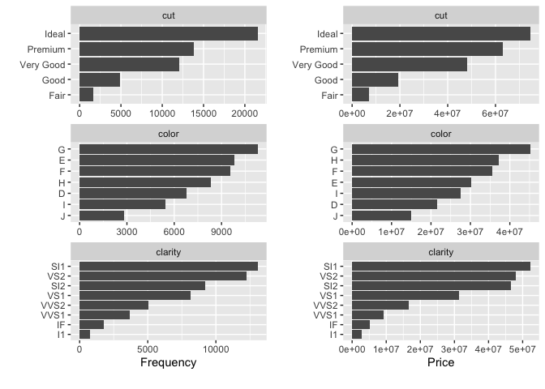

# DataExplorer 

[](https://cran.r-project.org/package=DataExplorer)
[](https://cran.r-project.org/package=DataExplorer)
[](https://cran.r-project.org/package=DataExplorer)
[](https://github.com/boxuancui/DataExplorer)
[](https://github.com/boxuancui/DataExplorer/actions/workflows/check-standard.yaml)
[](https://codecov.io/gh/boxuancui/DataExplorer)
[](https://bestpractices.coreinfrastructure.org/projects/2053)
[](code_of_conduct.md)

## Background

[Exploratory Data Analysis
(EDA)](https://en.wikipedia.org/wiki/Exploratory_data_analysis) is the
initial and an important phase of data analysis/predictive modeling.
During this process, analysts/modelers will have a first look of the
data, and thus generate relevant hypotheses and decide next steps.
However, the EDA process could be a hassle at times. This
[R](https://cran.r-project.org/) package aims to automate most of data
handling and visualization, so that users could focus on studying the
data and extracting insights.

## Installation

The package can be installed directly from CRAN.

``` r
install.packages("DataExplorer")
```

However, the latest stable version (if any) could be found on
[GitHub](https://github.com/boxuancui/DataExplorer), and installed using
`devtools` package.

``` r
if (!require(devtools)) install.packages("devtools")
devtools::install_github("boxuancui/DataExplorer")
```

If you would like to install the latest [development
version](https://github.com/boxuancui/DataExplorer/tree/develop), you
may install the develop branch.

``` r
if (!require(devtools)) install.packages("devtools")
devtools::install_github("boxuancui/DataExplorer", ref = "develop")
```

## Examples

The package is extremely easy to use. Almost everything could be done in
one line of code. Please refer to the package manuals for more
information. You may also find the package vignettes
[here](https://boxuancui.github.io/DataExplorer/articles/dataexplorer-intro.html).

#### Report

To get a report for the
[airquality](https://stat.ethz.ch/R-manual/R-devel/library/datasets/html/airquality.html)
dataset:

``` r
library(DataExplorer)
create_report(airquality)
```

To get a report for the
[diamonds](https://ggplot2.tidyverse.org/reference/diamonds.html)
dataset with response variable **price**:

``` r
library(ggplot2)
create_report(diamonds, y = "price")
```

#### Visualization

Instead of running `create_report`, you may also run each function
individually for your analysis, e.g.,

``` r
## View basic description for airquality data
introduce(airquality)
```

|                      |       |
|:---------------------|------:|
| rows                 |   153 |
| columns              |     6 |
| discrete_columns     |     0 |
| continuous_columns   |     6 |
| all_missing_columns  |     0 |
| total_missing_values |    44 |
| complete_rows        |   111 |
| total_observations   |   918 |
| memory_usage         | 6,376 |

``` r
## Plot basic description for airquality data
plot_intro(airquality)
```

<!-- -->

``` r
## View missing value distribution for airquality data
plot_missing(airquality)
```

<!-- -->

``` r
## Left: frequency distribution of all discrete variables
plot_bar(diamonds)
## Right: `price` distribution of all discrete variables
plot_bar(diamonds, with = "price")
```

<!-- -->

``` r
## View frequency distribution by a discrete variable
plot_bar(diamonds, by = "cut")
```

<!-- -->

``` r
## View histogram of all continuous variables
plot_histogram(diamonds)
```

<!-- -->

``` r
## View estimated density distribution of all continuous variables
plot_density(diamonds)
```

<!-- -->

``` r
## View quantile-quantile plot of all continuous variables
plot_qq(diamonds)
```

<!-- -->

``` r
## View quantile-quantile plot of all continuous variables by feature `cut`
plot_qq(diamonds, by = "cut")
```

<!-- -->

``` r
## View overall correlation heatmap
plot_correlation(diamonds)
```

<!-- -->

``` r
## View bivariate continuous distribution based on `cut`
plot_boxplot(diamonds, by = "cut")
```

<!-- -->

``` r
## Scatterplot `price` with all other continuous features
plot_scatterplot(split_columns(diamonds)$continuous, by = "price", sampled_rows = 1000L)
```

<!-- -->

``` r
## Visualize principal component analysis
plot_prcomp(diamonds, maxcat = 5L)
```

    #> 2 features with more than 5 categories ignored!
    #> color: 7 categories
    #> clarity: 8 categories

<!-- --><!-- -->

#### Feature Engineering

To make quick updates to your data:

``` r
## Group bottom 20% `clarity` by frequency
group_category(diamonds, feature = "clarity", threshold = 0.2, update = TRUE)

## Group bottom 20% `clarity` by `price`
group_category(diamonds, feature = "clarity", threshold = 0.2, measure = "price", update = TRUE)

## Dummify diamonds dataset
dummify(diamonds)
dummify(diamonds, select = "cut")

## Set values for missing observations
df <- data.frame("a" = rnorm(260), "b" = rep(letters, 10))
df[sample.int(260, 50), ] <- NA
set_missing(df, list(0L, "unknown"))

## Update columns
update_columns(airquality, c("Month", "Day"), as.factor)
update_columns(airquality, 1L, function(x) x^2)

## Drop columns
drop_columns(diamonds, 8:10)
drop_columns(diamonds, "clarity")
```

## Articles

See [article wiki
page](https://github.com/boxuancui/DataExplorer/wiki/Articles).
